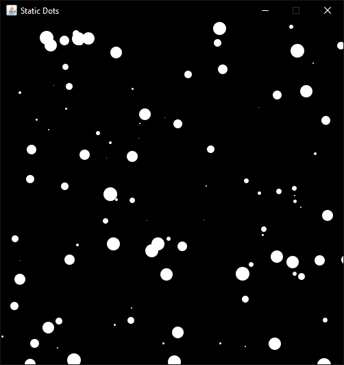

# [Graphics] Java Graphics

This is the repository of a graphics java project for my Graphics course at Leon Institute of Thechnology :mortar_board::lion:.

## :dart:GOAL

Create a graphic application with a canvas where to draw graphic elements.

## :gear:Installation

This project runs with maven, so in order to run the program you need to have **maven** installed in your machine.

Click over [here]('https://maven.apache.org/install.html') to install **maven.**

#### Steps :footprints:

1. **Pack the project.**
   `mvn package`
    

2. **Run the program using the correspondent argument:**

- Static dots example.
  `java -cp target\java-graphics-1.0.jar com.noisyapple.App static`

---

- Moving dots example.
  `java -cp target\java-graphics-1.0.jar com.noisyapple.App moving`

